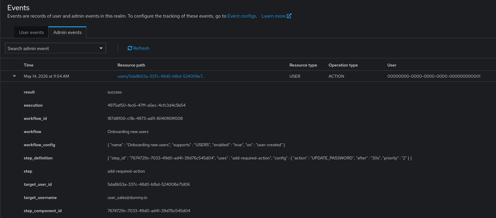
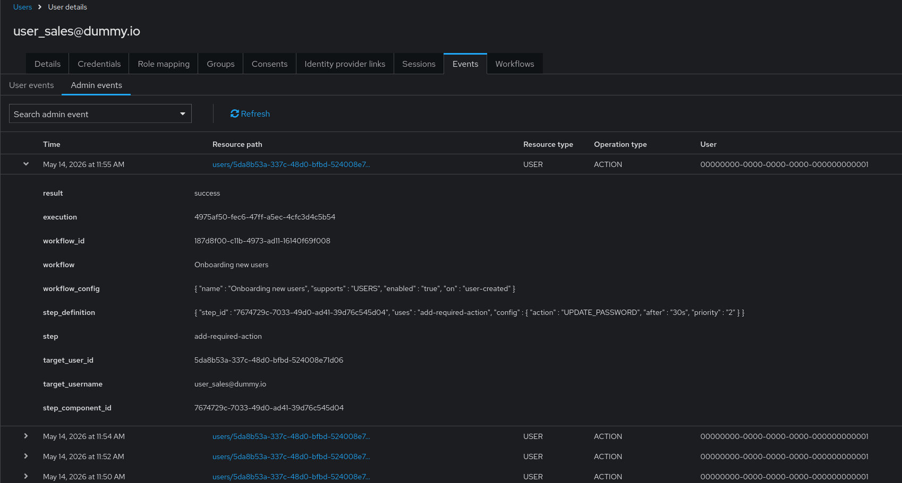

# Keycloak Workflow Admin Audit (event listener)

Maven module that ships a global `EventListenerProviderFactory` (`workflow-admin-audit`). It observes workflow step outcomes and emits realm admin events when user-scoped steps succeed or fail (`WorkflowStepExecutedEvent`, `WorkflowStepFailedEvent`). Scheduler-only noise (`WorkflowStepRunnerSuccessEvent`) is ignored.

## Prerequisites

- Keycloak with the workflows feature enabled.
- Target realm: Save admin events turned on.

## Build

From the repository root (use `999.0.0-SNAPSHOT` keycloak):

```bash
mvn clean install
```

Pin the Keycloak API to a release from Maven Central:

```bash
mvn clean install -Dkeycloak.version=26.0.0
```

## Install and enable

1. Copy the built JAR into your server `providers/` directory.
2. Run `kc.sh build`.
3. In the realm: enable Save admin events.

If nothing is recorded, confirm the JAR is on the classpath, the image was rebuilt, and startup logs show no provider load errors.

## Server configuration (optional)

| Key | Meaning |
|-----|---------|
| `spi-events-listener--workflow-admin-audit--enabled` | `true` (default) or `false` to disable emission. |
| `spi-events-listener--workflow-admin-audit--step-allowlist` | Comma-separated step provider ids (lowercase). If empty, the built-in default set applies (`grant-role`, `revoke-role`, `join-group`, `leave-group`, `set-user-attribute`, `remove-user-attribute`, `add-required-action`, `remove-required-action`, `notify-user`, `unlink-user`, `disable-user`, `delete-user`). |

For environment variables, follow the [Keycloak provider configuration](https://www.keycloak.org/server/configuration-provider) rules (`KC_SPI_…` mapping from the same logical key).

## AuthDetails (synthetic actor)

Admin events use stable synthetic `userId` and `clientId` constants defined in `WorkflowAdminAuditEventListenerFactory` so the UI shows a consistent non-interactive actor. They do not need to exist as real realm users or clients.

## Troubleshooting

- No admin rows for workflow actions: confirm Save admin events on the realm, the provider JAR is installed and the server was rebuilt, and `spi-events-listener--workflow-admin-audit--enabled` is not `false`.
- Steps missing from audit: the step id may be outside the allowlist; widen `step-allowlist` or compare with defaults in the factory class.

## Screenshots

<details>
<summary>Spoiler</summary>





</details>